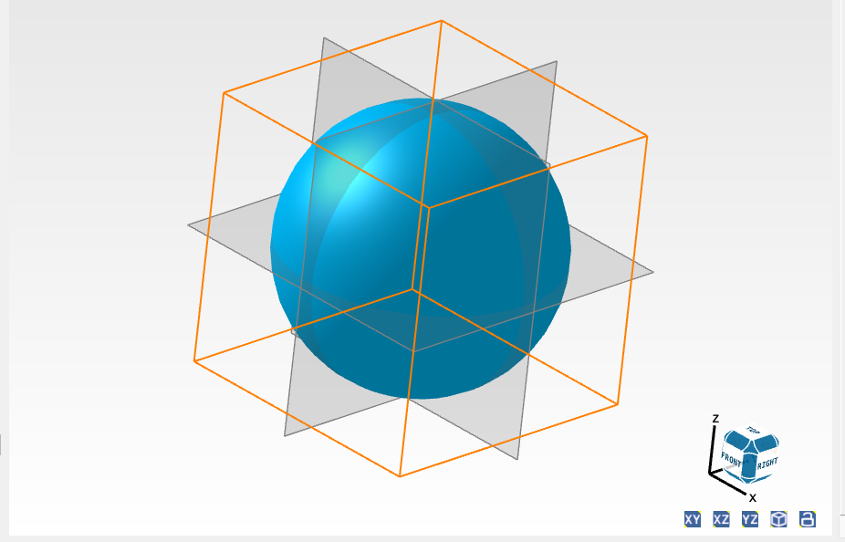
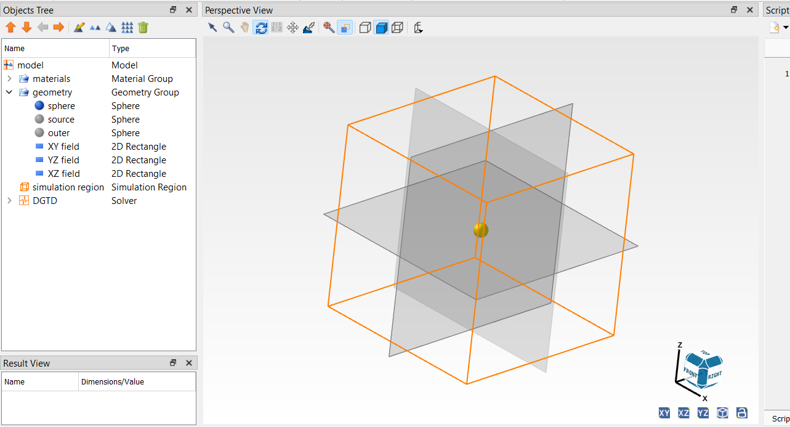
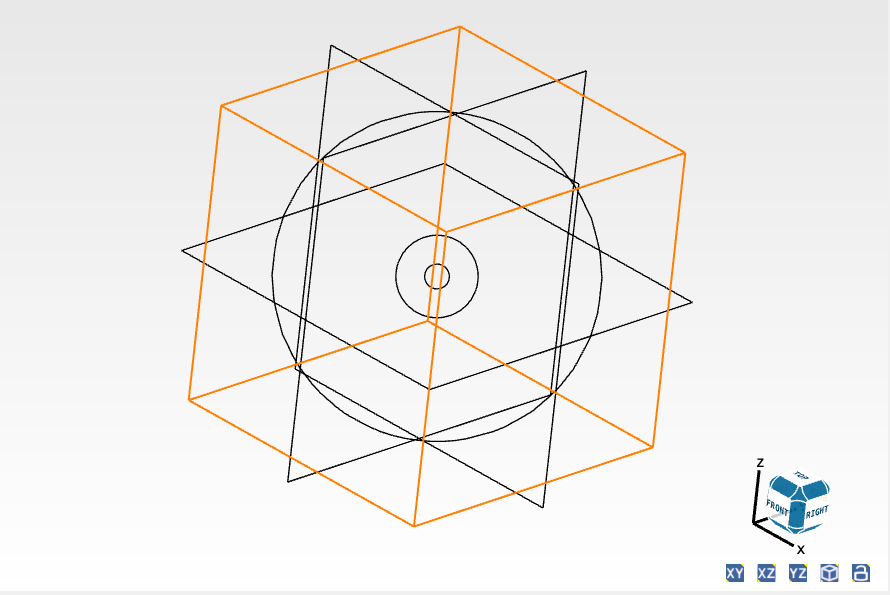
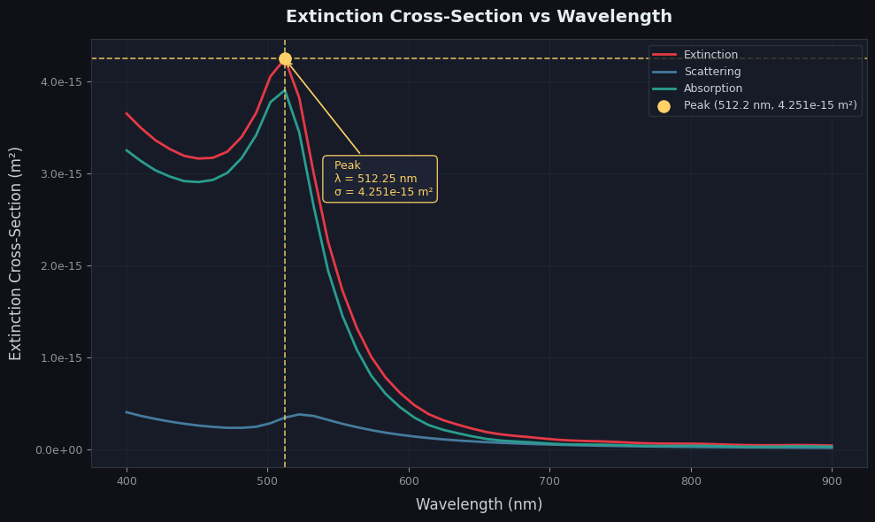
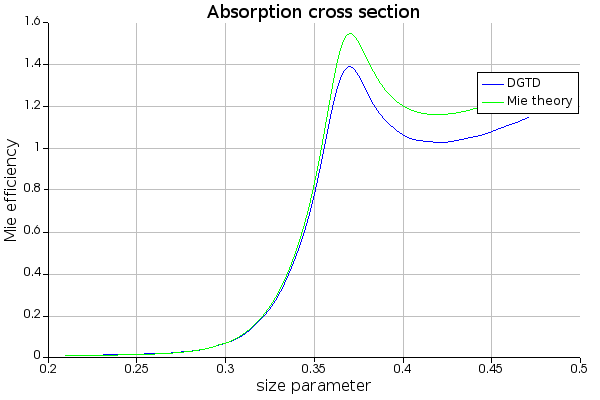
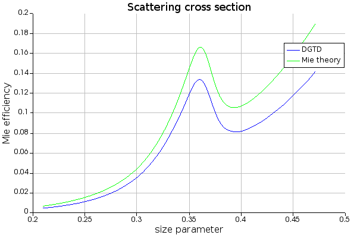
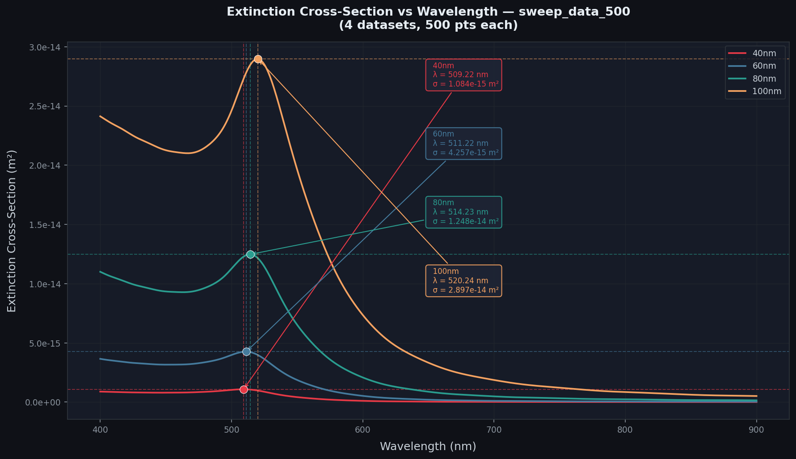
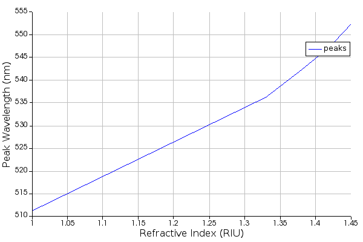
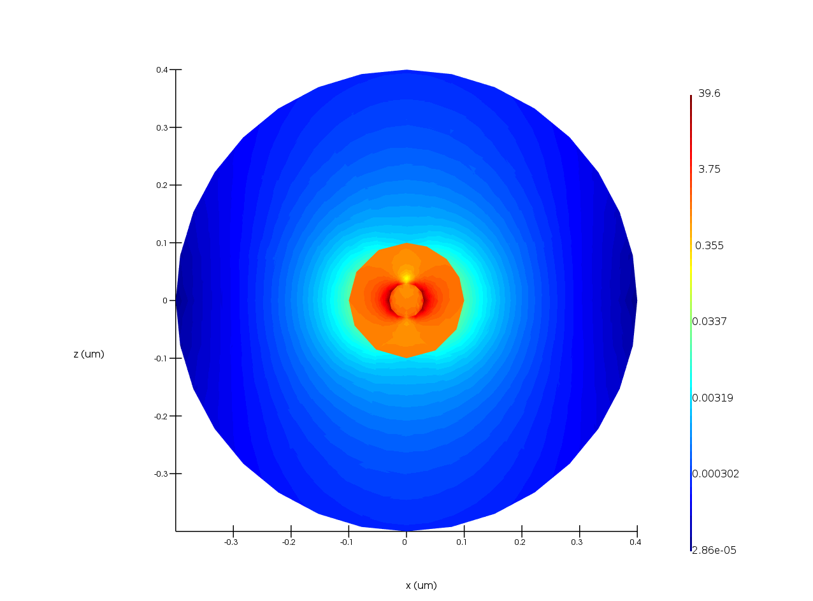
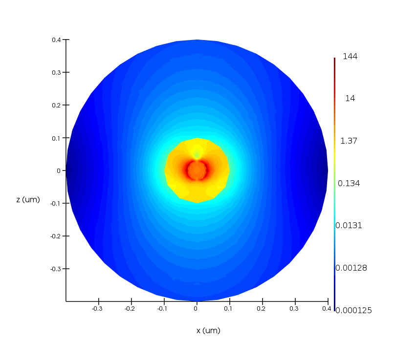

# lspr-nanoparticle-sensor
DGTD simulation of gold nanoparticle LSPR biosensor in Lumerical DGTD — extinction spectra, diameter sweep, refractive index sensitivity, near-field enhancement maps

# LSPR Gold Nanoparticle — Lumerical DGTD Simulation

Computational characterisation of the localized surface plasmon resonance (LSPR) response of a 60 nm gold nanosphere biosensor using DGTD in Ansys Lumerical. This project extracts extinction spectra, size-dependent resonance shifts, refractive index sensitivity, and near-field |E|² enhancement maps — the computational foundation of gold nanoparticle SPR biosensing platforms.

---

## Simulation Setup

| Parameter | Value |
|-----------|-------|
| Solver | Lumerical DGTD (Ansys 2020 R2) |
| Nanoparticle | Au sphere — Johnson & Christy model |
| Diameter (baseline) | 60 nm |
| Background (baseline) | Air, n = 1.00 |
| Source | Plane wave, 400–900 nm |
| Frequency points | 500 |

*Simulation geometry: gold nanosphere (yellow) at centre, TFSF source sphere 
(inner wireframe), scattering monitor sphere (outer wireframe), and three 
orthogonal field monitors (grey planes).*

The isolated and wireframe views of the simulation boundaries:

  

---

## Result 1 — Baseline Extinction Spectrum

Gold nanosphere (60 nm diameter) in air. LSPR resonance peak at **512.2 nm**.
Absorption dominates over scattering.
Dataset from DGTD plotted using python to be clearer.

---

## Result 2 — Mie Theory Validation

DGTD results compared against the analytical Mie theory solution using 
Lumerical's built-in `mie3d` function. Both absorption and scattering 
efficiencies peak at the same size parameter (~0.37), confirming simulation 
accuracy.

| | |
|--|--|
|  |  |

---

## Result 3 — Size-Dependent LSPR Shift (Diameter Sweep)

Diameter sweep: 40, 60, 80, 100 nm. LSPR peak redshifts with increasing 
diameter due to retardation effects, the particle is tiny compred to the light wave, the elctron at one side of the particle is not perfectly in sync with the electrons on the other side causing the shift of resonance. Amplitude grows as d³ — consistent with Mie theory.
Dataset from DGTD plotted using python to be clearer.

| Diameter (nm) | Peak wavelength (nm) |
|--------------|----------------------|
| 40 | 509.2 |
| 60 | 511.2 |
| 80 | 514.2 |
| 100 | 520.2 |

---

## Result 4 — Refractive Index Sensitivity

**Sensitivity S = 91.35 nm/RIU** — extracted from the slope of LSPR peak 
wavelength vs. surrounding medium refractive index across n = 1.00–1.45.

| n (RIU) | Peak wavelength (nm) |
|---------|----------------------|
| 1.00 (air) | 511.2 |
| 1.33 (water) | 536.2 |
| 1.38 | 542.2 |
| 1.42 | 547.3 |
| 1.45 (protein) | 552.3 |

In the biological sensing range (n = 1.33–1.45), a biomolecule binding 
event that increases local n by 0.01 RIU produces a peak shift of 
~0.9 nm.
---

## Result 5 — Near-Field |E|² Enhancement Maps

False-colour maps of electric field intensity |E|²/|E₀|² in the XZ plane 
at the respective LSPR resonance frequencies. The enhanced field decays 
exponentially from the particle surface - the evanescent sensing volume 
where biomolecules bind.

| Air (n=1.00, λ=511 nm) | Water (n=1.33, λ=536 nm) |
|------------------------|--------------------------|
|  |  |

| Medium | Peak enhancement |
|--------|-----------------|
| Air | 39.6× |
| Water | 143.8× |

Water gives 3.6× stronger enhancement than air - the higher refractive 
index medium increases local field confinement at the particle surface, 
directly amplifying biosensing sensitivity.

---

## Key Results Summary

| Result | Value |
|--------|-------|
| LSPR peak — air (n=1.00) | 511.2 nm |
| LSPR peak — water (n=1.33) | 536.2 nm |
| Refractive index sensitivity S | **91.35 nm/RIU** |
| Near-field enhancement — air | 39.6× |
| Near-field enhancement — water | 143.8× |
| Diameter sweep range | 509–520 nm (40–100 nm) |

---

## Why DGTD over FDTD

DGTD uses an unstructured tetrahedral mesh that conforms accurately to 
curved metal surfaces, eliminating the staircasing that degrade 
FDTD accuracy for spherical nanoparticles. Ansys Lumerical recommends 
DGTD for metal nanoparticle simulations.

---

## Connection to NRL Biosensor Research

This project computationally characterises the gold nanoparticle optical 
platform underlying SPR biosensor work published by the AUC Nanophotonics 
Research Laboratory (Prof. M. Swillam). The extracted sensitivity S and 
near-field enhancement maps provide the simulation foundation for 
experimental gold-film and nanoparticle SPR sensors targeting pathogen 
detection.

## References

1. Ansys Lumerical DGTD documentation – Mie scattering example
2. Hamza, Othman & Swillam – Plasmonic Biosensors Review, *Biology* MDPI (2022)
3. Hamad-Schifferli – Applications of gold nanoparticles in plasmonic and nanophotonic biosensing, *Adv. Biochem. Eng. Biotechnol.* (2024)
4. Johnson & Christy – optical constants of gold, *Phys. Rev. B* (1972)
5. NanoComposix – Plasmonics Tutorial, *nanocomposix.com*
6. Wikipedia – Surface plasmon resonance, *wikipedia.org*
---

*Jannah Ahmed — Ain Shams University, ECE Department*  
*April 2026*
